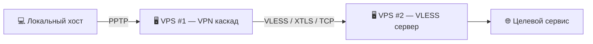

# 👁️‍🗨️ Око Гекаты  
**Cascading VPN architecture**

---

## 📑 Оглавление
1. [Описание](#описание)
2. [Использование](#использование)  
   2.1. [Требования](#требования)  
   2.2. [Установка](#установка)
3. [Схема соединения](#схема-соединения)
4. [Важно](#важно)
5. [Changelog](#changelog)
6. [Дисклеймер](#дисклеймер)

---

## Описание

**PPTP + XRay VLESS Transparent Proxy Installer**

Скрипт автоматической установки и настройки **PPTP VPN-сервера** с перенаправлением всего 'TCP'/'UDP' трафика через **XRay (VLESS, TPROXY)**.  

Функционал:
- Установка и настройка 'pptpd', 'xray-core' и необходимых пакетов
- Генерация и проверка 'VLESS URI', автоматическая сборка 'outbound'-конфигурации
- Настройка 'TPROXY'-маршрутизации для прозрачного проксирования
- Автоматическое сохранение правил 'iptables' и параметров ядра
- Создание 'systemd'-сервиса для восстановления 'TPROXY' после перезагрузки
- Генерация учетных данных 'PPTP VPN'

Полезно для быстрого развёртывания VPN-шлюза с проксированием трафика через VLESS/XRay

---

## Использование

### Требования
- У пользователя должна быть ссылка формата `vless://...`  
  >*это может быть собственный сервер или приобретённый доступ к VLESS-узлу*

### Установка
1. Подключитесь к серверу по SSH и запустите установку:
   ```bash
   bash -c "$(curl -s https://raw.githubusercontent.com/Ground-Zerro/HecateEye/main/hecate_eye-pptp-xray-vless.sh)"
   ```
2. Когда скрипт попросит, вставьте `vless://` ссылку.  

3. По завершении вы получите данные для подключения по 'PPTP':
   - **Сервер**: IP вашего VPS  
   - **Логин**: `vpnuser`  
     >*ограничений по числу подключению для данного логина нет*
   - **Пароль**: будет сгенерирован и показан в консоли  

4. Используйте эти данные для подключения к PPTP-VPN с вашего устройства.  
   >*весь PPTP трафик будет маршрутизироваться через upstream server*  

---

## Схема соединения



---

## Важно

Проект находится в **бета версии**, следует учитывать ряд ограничений:

- отсутствует механизм деинсталляции  
- повторная корректная переустановка не реализована  
- поддерживаются только ссылки формата `vless://`  
  *протоколы `ss://`, `vmess://`, `trojan://`, `tuic://` не поддерживаются*  
- обновление конфигурации XRay по новой `vless://` ссылке не предусмотрено  
- установка рекомендуется только на **чистую систему**  
- отсутствует менеджер пользователей для PPTP  

> **Протестировано:**
>- Ubuntu LTS 22.04 (рекомендуется)
>- Ubuntu LTS 24.04

---

## Changelog

Дата        | Изменения
------------|----------------------
24.09.25    | Публичный Beta релиз

---

## Дисклеймер

Предназначено **исключительно для образовательных целей**.  
>⚠️ Автор не несёт ответственности за любое использование, противоречащее действующему законодательству.  

⚖️ Пользователи обязаны самостоятельно убедиться в правомерности применения полученных знаний и решений в своей юрисдикции.  
🚫 Использование с целью нарушения законодательства недопустимо.  

🎯 Основное назначение — демонстрация современных методов организации сетевой инфраструктуры.  

Схема может применяться для:  
- 🔒 повышения уровня конфиденциальности при работе в сети,  
- 🛡 обеспечения целостности и защиты данных,  
- 🌐 организации маршрутизации через независимые каналы связи.  

Информация носит образовательный характер и может использоваться исключительно для изучения:  
- 📡 принципов построения коммуникационных систем,  
- 🔄 практики настройки каскадных VPN-цепочек,  
- ⚡ возможностей и особенностей протокола **VLESS**,  
- 🏗 современных методов обеспечения устойчивости сетевых решений.  

👨‍💻 Материалы служат дополнением к учебным ресурсам для специалистов и энтузиастов, интересующихся вопросами защиты данных, надёжности соединений и построения доверенной сетевой среды.

