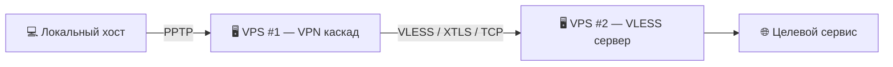

# 👁️‍🗨️ Око Гекаты  
**Cascading VPN architecture**

---

## 📑 Оглавление
1. [Описание](#описание)
2. [Требования](#требования)
3. [Установка](#установка)
4. [Схема соединения](#схема-соединения)
5. [Важно](#важно)
6. [Дисклеймер](#дисклеймер)

---

## Описание

Основное назначение — демонстрация современных методов организации безопасной сетевой инфраструктуры.

Схема предназначена для:
- повышения уровня конфиденциальности при работе в сети,
- обеспечения целостности и защиты данных,
- реализации дополнительного уровня шифрования,
- организации маршрутизации через независимые каналы связи.

Приведённая здесь информация носит образовательный характер и должна использоваться исключительно для изучения:
- принципов построения защищённых коммуникационных систем,
- практики настройки каскадных VPN-цепочек,
- возможностей и особенностей протокола VLESS,
- современных методов обеспечения безопасности и устойчивости сетевых решений.

Проект служит дополнением к учебным материалам предназначенным для специалистов и энтузиастов, интересующихся вопросами защиты данных, 
повышенной надёжности соединений и построения доверенной сетевой среды.

✅ Протестировано на:
- **Ubuntu LTS 22.04** (рекомендуется)
- **Ubuntu LTS 24.04**

---

## Установка и использование

### Требования
- У пользователя должна быть готовая ссылка формата `vless://...`  
  (это может быть собственный сервер или приобретённый доступ к VLESS-узлу).

### Установка
1. Подключитесь к вашему серверу по SSH и запустите установку:
   ```bash
   bash -c "$(curl -s https://raw.githubusercontent.com/Ground-Zerro/HecateEye/main/hecate_eye-pptp-xray-vless.sh)"
   ```
2. Когда скрипт попросит, вставьте вашу `vless://` ссылку.  
   *скрипт проверит её и автоматически соберёт конфигурацию XRay.*

3. По завершении вы получите данные для подключения по PPTP:
   - **Сервер**: IP вашего VPS  
   - **Логин**: `vpnuser`  
     *ограничений по числу подключению для данного логина нет.*
   - **Пароль**: будет сгенерирован автоматически и показан в консоли  

4. Используйте эти данные для подключения к PPTP-VPN с вашего устройства.  
   *весь PPTP трафик будет маршрутизироваться через upstream server.*  

---

## Схема соединения



---

## Важно

Проект находится в стадии **бета-тестирования**, поэтому следует учитывать ряд ограничений:

- отсутствует механизм деинсталляции  
- повторная корректная переустановка не реализована  
- поддерживаются только ссылки формата `vless://`  
  (протоколы `ss://`, `vmess://`, `trojan://`, `tuic://` не поддерживаются)  
- обновление конфигурации XRay по новой `vless://` ссылке не предусмотрено  
- установка возможна только на **чистую систему**  
- отсутствует менеджер пользователей для PPTP  

---

## Дисклеймер

Проект предназначен **исключительно для образовательных целей**.  
Автор не несёт ответственности за любое использование материалов, которое может противоречить действующему законодательству.

Пользователи обязаны самостоятельно убедиться в правомерности применения полученных знаний и решений в своей юрисдикции. 
Использование проекта с целью нарушения требований законодательства недопустимо.
